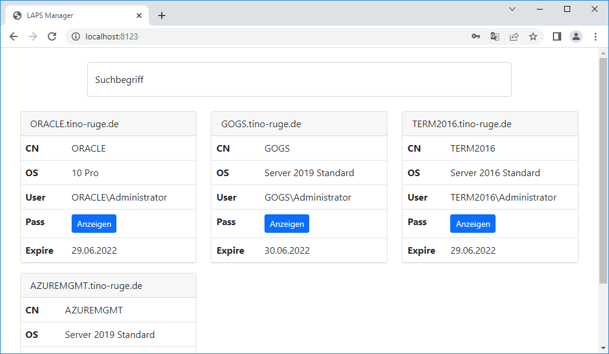
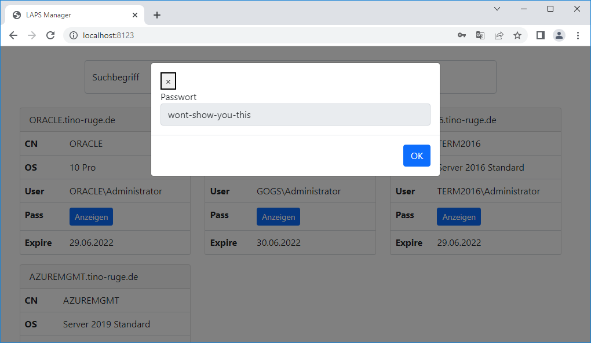

# LAPS Manager
Webinterface to view local admin passwords generated by LAPS

## Explained  
LAPS is a software changing passwords of local administrator users on a regular base after storing them in an Active Directory domain.  
Currently with LAPS you can only view the current password by connecting to a different server and launching a specific tool (or using PowerShell).  
This program reads the LAPS passwords directly from LDAP and allows viewing them on a website.

## Requirements  
You need to know an domain admin user (or an user whom was granted to access the LDAP attributes, for more information see LAPS documentation).  
And you need to install node.js on the server hosting this application.

## Security advice
This is just a proof of concept. This tool hosts just an HTTP website, there is no encryption in any form.  
Authorization is done via Active Directory. Everyone with legit a legit AD login can see any local administrator passwords.  
Don't use it in prod environment before integrating some kind of ACL or smth in it.

## Installation
Simply install node.js and (if required) make this app a service using e.g. nssm

## Configuration  
Copy `/config/example.config.js` to `/config/config.js` and customize it.
```
{
	"LAPS": {
		"Username": "Administrator"                 # The user that is currently managed by LAPS
	},
	"DC": {
		"IP": "192.168.0.10",                       # IP of DC
		"Username": "administrator@tino-ruge.de",   # Account with permissions to access LAPS attributes
		"Password": "NomenEstOmen2022",             # Password of account
		"BaseDN": "dc=tino-ruge,dc=de"              # DN to search for computers
	},
	"Server": {
		"HTTPPort": 8123                            # Port HTTP server should be running on
	}
}
```

## Screenshots

### Login page


### Computer list page


### Password view prompt
